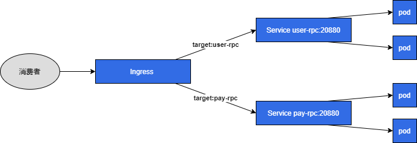

## dubbo 七层网关

dubbo 消费者请求统一经过网关，网关根据目标提供者`application.name`作为虚拟 host 进行转发，以复用同一端口，降低手动管理 dubbo 提供者服务端口的复杂度。

> 注：目前仅适用于开发环境

## 架构图



## 背景

由于公司内部所有服务都是跑在阿里云 k8s 上的，如果我们本地开发需要访问 k8s 内的 dubbo 提供者服务的话，需要手动通过`k8s service`把服务暴露到外网，我们的做法是针对每一个提供者服务暴露一个`SLB IP+自定义端口`，并且通过 dubbo 提供的`DUBBO_IP_TO_REGISTRY`和`DUBBO_PORT_TO_REGISTRY`环境变量来把对应的`SLB IP+自定义端口`注册到注册中心里，可是好景不长，当 dubbo 提供者服务越来越多时，会发现这种方式管理起来会带来不小的麻烦。

于是我就在想能不能像`nginx`一样实现一个七层负载，通过目标提供者的`application.name`来做对应的转发，这样的话所有的服务只需要注册同一个`SLB IP+端口`就可以了，然后本项目就诞生了！

## 使用说明

### 0. 前置要求

- dubbo 3.0+
- dubbo 协议+hession 序列化

### 1. 安装`dubbo-ingress-controller`

下载本项目中的[deploy.yaml](./deploy.yaml)，然后执行命令：

```sh
kubectl apply -f deploy.yaml
```

### 2. 暴露`dubbo-ingress-controller`服务到外网

可以通过`NodePort`、`SLB`等方式进行暴露，暴露出来的`外网IP+端口`就是需要上报到注册中心的地址。

### 3. 创建服务对应的 ingress

为每个提供者服务创建对应的 ingress 资源，示例：

```yaml
apiVersion: extensions/v1beta1
kind: Ingress
metadata:
  name: user-rpc-ingress
  annotations:
    kubernetes.io/ingress.class: "dubbo"
spec:
  rules:
    - host: user-rpc
      http:
        paths:
          - backend:
              serviceName: user-rpc-service
              servicePort: 20880
            path: /
```

这里有几点需要注意：

1. `kubernetes.io/ingress.class`注解目前固定为`dubbo`
2. `host`为 dubbo 提供者的`application.name`
3. `backend.serviceName和backend.servicePort`是 dubbo 提供者服务暴露的`service`

### 4. 消费者添加自定义 Filter

由于默认请求下，dubbo 请求不会携带目标提供者的`application.name`，为此我特意向 dubbo 官方提了个[issue](https://github.com/apache/dubbo/issues/9251)，那边提供的建议是通过`自定义Filter`来实现，附代码：

```java
import static org.apache.dubbo.common.constants.CommonConstants.CONSUMER;

import org.apache.dubbo.common.extension.Activate;
import org.apache.dubbo.common.utils.StringUtils;
import org.apache.dubbo.rpc.Filter;
import org.apache.dubbo.rpc.Invocation;
import org.apache.dubbo.rpc.Invoker;
import org.apache.dubbo.rpc.Result;
import org.apache.dubbo.rpc.RpcException;


@Activate(group = CONSUMER)
public class AddTargetFilter implements Filter {

  @Override
  public Result invoke(Invoker<?> invoker, Invocation invocation) throws RpcException {
    String targetApplication = StringUtils.isBlank(invoker.getUrl().getRemoteApplication()) ?
        invoker.getUrl().getGroup() : invoker.getUrl().getRemoteApplication();
    invocation.setAttachment("target-application", targetApplication);
    return invoker.invoke(invocation);
  }
}
```

添加`dubbo SPI`配置文件`META-INF/dubbo/org.apache.dubbo.rpc.Filter`，配置该 Filter。

### 5. 提供者启动时注入对应环境变量

通过环境变量将 dubbo ingress controller 暴露的外网 IP 和端口注册到注册中心，示例：

```
DUBBO_IP_TO_REGISTRY=8.8.8.8
DUBBO_PORT_TO_REGISTRY=20880
```

一切准备就绪之后，就可以在本地启动消费者进行 dubbo 服务调用了。

## 实现思路

[手撸一个ingress controller来打通dubbo+k8s网络](https://monkeywie.cn/2021/11/16/dubbo-in-k8s/)
